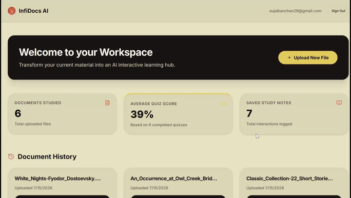
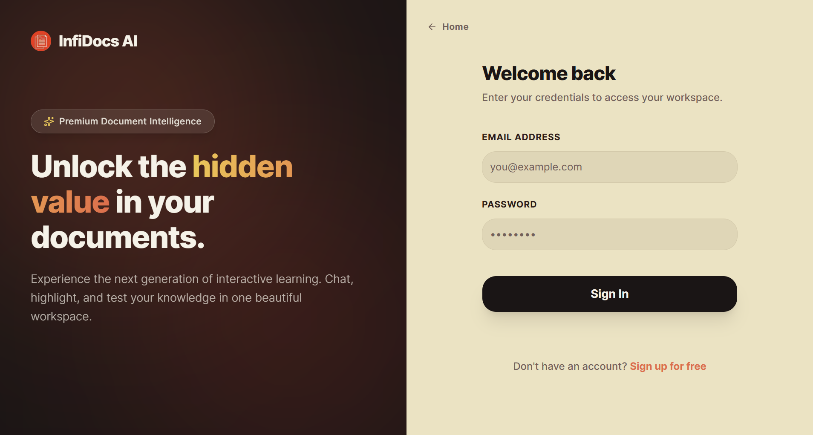
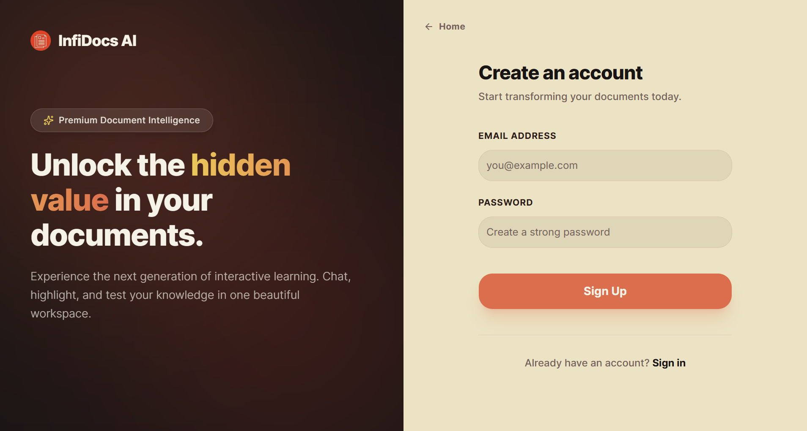
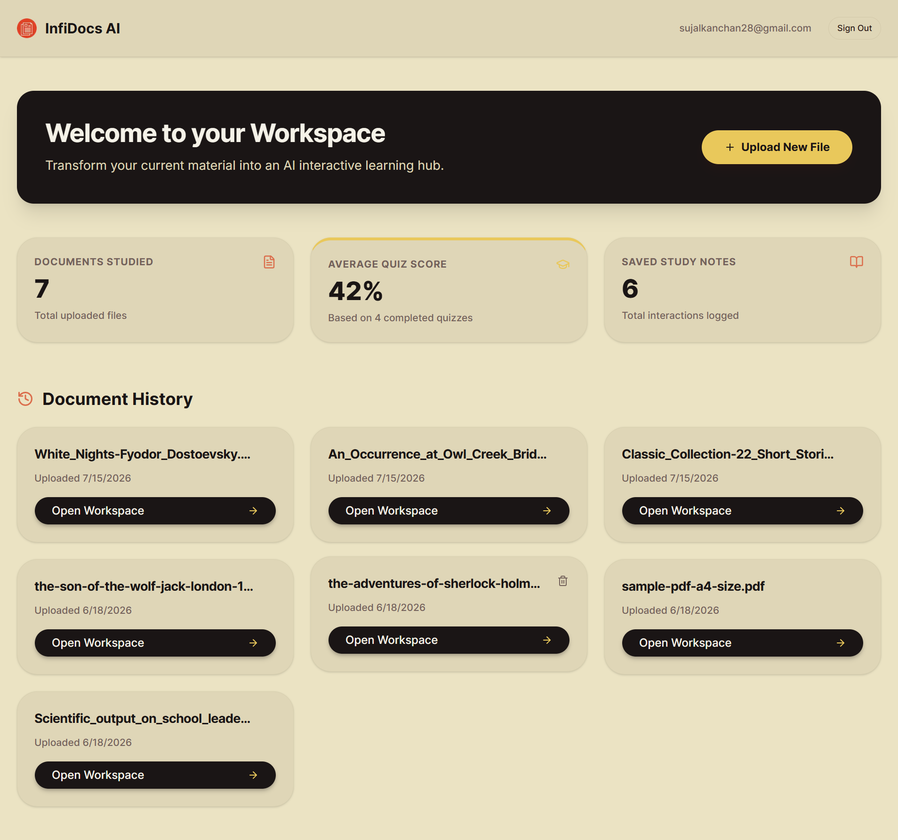

<div align="center">
  
# 📚 Infidocs AI

</div>

<div align="center">

### An AI-Powered Document Learning Platform Built with Next.js, RAG & Groq

Transform PDFs into interactive learning workspaces with AI-powered conversations, study notes, quizzes, and flashcards—all from a single document.

<p>
  <a href="https://infi-docs-ai.vercel.app" target="_blank">
    
  </a>
</p>

<p>
  
  
  
  
  
  
</p>

<p>
  
  
  
  
</p>

</div>

---

# 📖 Overview

**Infidocs AI** is a modern AI-powered document learning platform that transforms traditional PDF documents into interactive learning experiences. Built with **Next.js 16**, **React 19**, **TypeScript**, **Supabase**, and **Groq**, the application leverages **Retrieval-Augmented Generation (RAG)** to provide accurate, document-grounded answers without relying on external knowledge.

Instead of simply viewing PDFs, users can upload documents and instantly convert them into intelligent study workspaces. Each uploaded document becomes an interactive environment where users can ask questions, generate study notes, test their understanding through quizzes, and reinforce learning using flashcards.

Designed with both performance and reliability in mind, Infidocs AI performs PDF parsing entirely on the server, reducing browser overhead while maintaining fast response times. Its strict grounding strategy ensures that AI responses remain faithful to the uploaded document, minimizing hallucinations and improving trustworthiness.

Whether you're studying lecture notes, reviewing technical documentation, or exploring research papers, Infidocs AI provides an efficient and engaging way to learn directly from your documents.

---

# ✨ Features

## 🤖 AI-Powered Document Chat

Interact naturally with uploaded PDFs using conversational AI.

Features include:

- Ask questions in natural language
- Context-aware responses
- Real-time AI conversations
- Document-specific answers
- Fast response generation

---

## 🧠 Retrieval-Augmented Generation (RAG)

Every AI response is grounded in the uploaded document rather than relying on general model knowledge.

Key capabilities include:

- Document-aware context retrieval
- Source-grounded responses
- Reduced hallucinations
- Secure server-side processing
- Optimized context management

---

## 📄 PDF Upload & Processing

Users can upload PDF documents directly to create personalized learning workspaces.

Processing pipeline includes:

- Secure PDF uploads
- Server-side text extraction
- Automatic document processing
- Fast parsing workflow
- Cloud-backed storage integration

---

## 📝 AI Study Notes

Generate concise study notes directly from your uploaded document.

Study notes help users:

- Review important concepts
- Summarize lengthy documents
- Create revision material
- Improve learning efficiency

---

## ❓ Interactive Quiz Engine

Evaluate your understanding through AI-generated quizzes.

Quiz features include:

- Document-based questions
- Interactive assessments
- Learning reinforcement
- Knowledge evaluation

---

## 🗂️ Flashcard Learning

Strengthen memory through active recall.

Flashcards provide:

- Bite-sized learning content
- AI-generated study cards
- Quick revision sessions
- Modular learning experience

---

## 🛡️ Anti-Hallucination AI

One of Infidocs AI's core strengths is its strict grounding strategy.

The AI:

- Only answers using document content
- Avoids unsupported assumptions
- Rejects unknown information
- Returns a clear fallback response when the answer is unavailable

This significantly improves the reliability of generated responses.

---

## ⚡ Optimized Server-Side PDF Parsing

Rather than parsing PDFs in the browser, Infidocs AI performs extraction entirely on the server.

Benefits include:

- Faster processing
- Reduced browser workload
- Improved compatibility
- Better scalability
- Lower client-side resource usage

---

## 📱 Responsive Learning Workspace

The workspace is designed for seamless use across devices.

Features include:

- Responsive navigation
- Mobile-friendly controls
- Adaptive layouts
- Touch-friendly interactions
- Horizontal overflow optimization

---

## 🎨 Modern Learning Interface

Infidocs AI adopts a clean, distraction-free design built around an earthy, high-contrast visual theme.

Highlights include:

- Minimalist workspace
- Soft earthy color palette
- High readability
- Responsive layouts
- Accessible typography
- Smooth navigation experience

---

# 🚀 Why Infidocs AI?

Infidocs AI was created as a hands-on exploration of how modern AI technologies can enhance document-based learning.

Rather than building a traditional PDF viewer, the goal was to combine **Large Language Models**, **Retrieval-Augmented Generation**, **server-side document processing**, and **interactive learning tools** into a unified educational platform.

Throughout development, the project explored practical concepts including:

- Retrieval-Augmented Generation (RAG)
- AI-assisted learning workflows
- Serverless API routes
- Secure authentication
- PDF text extraction
- Context-aware prompting
- Full-stack application architecture
- Cloud storage integration
- Modern Next.js App Router patterns
- Type-safe development with TypeScript

The result is a scalable, AI-first learning platform that demonstrates how modern web technologies and language models can work together to improve the study experience.

---

# 🛠️ Tech Stack

## Frontend

| Technology | Purpose |
|------------|---------|
| Next.js 16 (App Router) | Full-stack React Framework |
| React 19 | User Interface |
| TypeScript | Type Safety |
| Tailwind CSS v4 | Styling |
| Lucide React | Icons |
| React PDF | PDF Rendering |

---

## Backend

| Technology | Purpose |
|------------|---------|
| Next.js Route Handlers | Serverless API |
| Groq SDK | AI Inference |
| pdf2json | Server-side PDF Parsing |
| pdf-parse | Fallback PDF Processing |

---

## Database & Backend Services

| Technology | Purpose |
|------------|---------|
| Supabase | Database & Backend Services |
| Supabase Auth | Authentication |
| Supabase Storage | PDF Storage |

---

## AI Stack

| Technology | Purpose |
|------------|---------|
| Groq | AI Platform |
| Llama 3.1 8B Instant | Language Model |
| Retrieval-Augmented Generation (RAG) | Document Grounding |

---

## Development Tools

- Git
- GitHub
- VS Code
- npm

---

# 🏗️ Architecture

Infidocs AI follows a modern serverless architecture where the Next.js frontend, API routes, AI inference pipeline, and Supabase services work together to deliver document-grounded learning experiences.

```text
                    ┌─────────────────────┐
                    │        User         │
                    └──────────┬──────────┘
                               │
                               ▼
                   Next.js 16 Frontend
                               │
                               ▼
                 Serverless API Routes
                               │
                ┌──────────────┼──────────────┐
                ▼                             ▼
        Supabase Database            Supabase Storage
                │                             │
                └──────────────┬──────────────┘
                               ▼
                     PDF Text Extraction
                               │
                               ▼
                  Retrieval-Augmented Generation
                               │
                               ▼
                     Groq Llama 3.1 8B Instant
                               │
                               ▼
                       AI Response to User
```

---

## High-Level Application Flow

```text
User
   │
   ▼
Authentication
(Login / Signup)
   │
   ▼
Upload PDF
   │
   ▼
Create Workspace
   │
   ▼
AI Processing
   │
   ▼
Interactive Learning Tools
   │
   ├───────────────┐
   ▼               ▼
AI Chat       Study Notes
   │               │
   ├───────────────┤
   ▼               ▼
Quiz Engine   Flashcards
```

---

## Project Structure

```text
infidocs-ai/
│
├── app/
│   ├── (auth)/
│   ├── api/
│   │   ├── chat/
│   │   ├── flashcards/
│   │   └── quiz/
│   │
│   ├── workspace/
│   │   └── [id]/
│   │
│   ├── layout.tsx
│   └── page.tsx
│
├── components/
│   ├── ui/
│   └── workspace/
│
├── lib/
│   └── supabase/
│
├── package.json
└── tsconfig.json
```

## 🎬 Live Demo

<p align="center">
  
</p>

---

## 📸 Screenshots

### 🏠 Landing Page


---

### 🔐 Sign In



---

### 📝 Sign Up



---

### 📊 Dashboard



---

### 💬 AI Chat Workspace


---

### 📝 AI Notes


---

### 🧠 AI Quiz


---

### 🏆 Quiz Results


---

### 🃏 Flashcards


---

### 📄 Learning Summary Report


---

# 🌐 Live Demo

### 🚀 Application

**Infidocs AI**

https://infi-docs-ai.vercel.app

---

## ☁️ Deployment

| Service | Platform |
|---------|----------|
| Frontend | Vercel |
| API Routes | Next.js Serverless (Vercel) |
| Database | Supabase |
| Authentication | Supabase Auth |
| File Storage | Supabase Storage |
| AI Model | Groq (Llama 3.1 8B Instant) |

---

> **Next:** Installation, environment variables, project setup, authentication flow, RAG pipeline, API routes, deployment details, and application workflow.


# ⚙️ Installation

Follow the steps below to set up **Infidocs AI** on your local machine.

## 📋 Prerequisites

Before getting started, ensure the following tools are installed:

- Node.js (v20 or later recommended)
- npm
- Git
- A Supabase project
- A Groq API key

Verify your installation:

```bash
node -v
npm -v
git --version
```

---

# 📥 Clone the Repository

```bash
git clone https://github.com/<your-github-username>/infidocs-ai.git
```

Navigate into the project directory:

```bash
cd infidocs-ai
```

---

# 📦 Install Dependencies

Install all project dependencies.

```bash
npm install
```

---

# 🔑 Environment Variables

Infidocs AI relies on environment variables for AI services, authentication, and cloud storage.

Create a `.env.local` file in the project root.

```text
infidocs-ai/
│
├── .env.local
├── app/
├── components/
└── ...
```

Add the following variables:

```env
GROQ_API_KEY=your_groq_api_key

NEXT_PUBLIC_SUPABASE_URL=https://your-project.supabase.co

NEXT_PUBLIC_SUPABASE_ANON_KEY=your_supabase_anon_key
```

---

## Environment Variable Reference

| Variable | Description |
|----------|-------------|
| `GROQ_API_KEY` | API key used to communicate with the Groq inference platform |
| `NEXT_PUBLIC_SUPABASE_URL` | Supabase project URL |
| `NEXT_PUBLIC_SUPABASE_ANON_KEY` | Public client key used for authentication and database access |

> **Important:** Never commit `.env.local` or secret API keys to your repository.

---

# ▶️ Running the Application

Start the development server:

```bash
npm run dev
```

The application will be available at:

```text
http://localhost:3000
```

Open your browser and visit:

```text
http://localhost:3000
```

---

# 📂 Project Structure

The project follows the modern **Next.js App Router** architecture, separating routes, API handlers, reusable UI components, and utility modules.

```text
infidocs-ai/
│
├── app/
│   ├── (auth)/
│   │   ├── login/
│   │   └── signup/
│   │
│   ├── api/
│   │   ├── chat/
│   │   ├── flashcards/
│   │   └── quiz/
│   │
│   ├── workspace/
│   │   └── [id]/
│   │
│   ├── layout.tsx
│   └── page.tsx
│
├── components/
│   ├── ui/
│   └── workspace/
│
├── lib/
│   └── supabase/
│
├── public/
├── package.json
└── tsconfig.json
```

---

# 🚀 Application Workflow

The following sequence illustrates how users interact with Infidocs AI.

```text
Launch Application
        │
        ▼
User Authentication
        │
        ▼
Dashboard
        │
        ▼
Upload PDF
        │
        ▼
Create Learning Workspace
        │
        ▼
AI Processing
        │
        ▼
Interactive Learning
```

Inside every workspace, users can seamlessly switch between multiple AI-powered learning tools.

```text
Workspace
     │
     ├───────────────┐
     ▼               ▼
 AI Chat       Study Notes
     │               │
     ├───────────────┤
     ▼               ▼
 Quiz Engine   Flashcards
```

---

# 🔐 Authentication Flow

Authentication is powered by **Supabase Email & Password Authentication**.

## User Registration

1. User creates an account.
2. Supabase securely stores credentials.
3. Authentication session is created.
4. User gains access to the dashboard.

---

## User Login

1. User enters credentials.
2. Supabase validates the account.
3. Authentication session is restored.
4. Protected pages become accessible.

---

## Protected Workspaces

Only authenticated users can:

- Upload PDFs
- Access workspaces
- Generate AI content
- Use quizzes
- Create flashcards
- Interact with the AI assistant

---

# 📄 PDF Processing Workflow

When a user uploads a PDF, Infidocs AI automatically prepares it for AI-powered learning.

Processing pipeline:

```text
Upload PDF
      │
      ▼
Supabase Storage
      │
      ▼
Document Metadata
      │
      ▼
Workspace Created
```

Later, whenever the user interacts with the document, the server retrieves the PDF directly from cloud storage for processing.

---

# 🤖 Retrieval-Augmented Generation (RAG) Workflow

Infidocs AI uses a Retrieval-Augmented Generation pipeline to ensure responses remain grounded in the uploaded document.

```text
User Question
       │
       ▼
Next.js API Route
       │
       ▼
Lookup Document
       │
       ▼
Retrieve PDF from Supabase Storage
       │
       ▼
Extract Text with pdf2json
       │
       ▼
Context Optimization
(15,000 Character Limit)
       │
       ▼
System Prompt Construction
       │
       ▼
Groq Llama 3.1 8B
       │
       ▼
Grounded AI Response
```

---

## Context Optimization

To improve performance and reduce inference latency, extracted document text is safely truncated before being passed to the language model.

Benefits include:

- Faster responses
- Lower token usage
- Reduced API costs
- More predictable inference times
- Consistent prompt sizes

---

## Anti-Hallucination Strategy

One of Infidocs AI's defining features is its strict grounding policy.

The AI is instructed to:

- Use only document content
- Avoid unsupported assumptions
- Ignore external knowledge
- Return a predefined fallback message whenever the answer is unavailable

Fallback response:

```text
"I'm sorry, I cannot find the answer to that in the current document."
```

This significantly improves answer reliability for educational use cases.

---

# 💬 Workspace Modules

Every uploaded document becomes an interactive learning workspace.

## 🤖 AI Chat

Ask natural language questions about the document and receive grounded responses.

---

## 📝 Study Notes

Generate concise summaries and revision material extracted from the document.

---

## ❓ Quiz Engine

Create AI-generated quizzes to reinforce understanding and test knowledge.

---

## 🗂️ Flashcards

Generate flashcards for active recall and efficient revision.

---

# 📡 API Routes

Infidocs AI leverages Next.js Route Handlers to implement serverless backend functionality.

## AI Chat

| Method | Route | Description |
|---------|-------|-------------|
| POST | `/api/chat` | Generate grounded AI responses using RAG |

---

## Flashcards

| Method | Route | Description |
|---------|-------|-------------|
| POST / GET | `/api/flashcards` | Generate and retrieve flashcards |

---

## Quiz

| Method | Route | Description |
|---------|-------|-------------|
| POST / GET | `/api/quiz` | Generate and retrieve quizzes |

---

# 🔄 Data Flow

The overall request lifecycle can be summarized as follows:

```text
React Components
        │
        ▼
Next.js Server Actions / API Routes
        │
        ▼
Supabase
(Database + Storage)
        │
        ▼
PDF Retrieval
        │
        ▼
pdf2json Extraction
        │
        ▼
Groq AI
        │
        ▼
Structured Response
        │
        ▼
React UI Update
```

---

# ☁️ Deployment

Infidocs AI is fully deployed using a modern serverless architecture.

## Frontend

**Platform**

- Vercel

**Live URL**

```text
https://infi-docs-ai.vercel.app
```

---

## Backend

The application does not use a separate backend server.

Instead, all backend functionality is implemented using:

- Next.js Route Handlers
- Serverless API Routes
- Vercel Functions

This simplifies deployment while keeping both frontend and backend within a single codebase.

---

## Database & Storage

| Service | Platform |
|---------|----------|
| Database | Supabase |
| Authentication | Supabase Auth |
| File Storage | Supabase Storage |

---

## AI Infrastructure

| Component | Platform |
|-----------|----------|
| AI Provider | Groq |
| Language Model | Llama 3.1 8B Instant |
| Prompt Strategy | Retrieval-Augmented Generation (RAG) |

---

# 🌍 Production Architecture

```text
                    Users
                      │
                      ▼
              Vercel Deployment
                      │
        ┌─────────────┼─────────────┐
        ▼                           ▼
 Next.js Frontend          Serverless API Routes
        │                           │
        └─────────────┬─────────────┘
                      ▼
                Supabase Services
        ┌─────────────┼─────────────┐
        ▼             ▼             ▼
 Authentication   Database     File Storage
                      │
                      ▼
               PDF Processing
                      │
                      ▼
                Groq AI Platform
```

---

# 🔒 Security Highlights

Security has been incorporated throughout the application architecture.

Key practices include:

- Secure Supabase authentication
- Protected server-side API routes
- Environment variable isolation
- Secure cloud file storage
- Server-side PDF parsing
- AI responses grounded only in uploaded documents
- No client-side exposure of AI credentials
- Controlled prompt construction
- Reduced hallucination through strict context enforcement

---

# 🌐 Browser Compatibility

Infidocs AI supports all major modern browsers.

- ✅ Google Chrome
- ✅ Microsoft Edge
- ✅ Mozilla Firefox
- ✅ Brave
- ✅ Opera
- ✅ Safari

---

# 📱 Responsive Design

The interface is fully responsive and optimized for a wide range of devices.

Supported devices include:

- Desktop
- Laptop
- Tablet
- Mobile

The workspace adapts automatically, ensuring that AI Chat, Notes, Quiz, and Flashcards remain accessible and usable across different screen sizes.

---

> **Next:** User interface highlights, AI architecture, technical implementation, learning outcomes, future roadmap, contributing, license, acknowledgements, and project footer.


# 🎨 User Interface Highlights

Infidocs AI is designed to provide a focused, distraction-free learning experience where the document remains at the center of every interaction. The interface emphasizes readability, intuitive navigation, and seamless transitions between AI-powered learning tools.

---

## 🌿 Modern Earthy Design System

Unlike traditional light or dark themes, Infidocs AI adopts a warm, earthy visual identity inspired by paper-based reading experiences.

The design features:

- 🌿 Soft earthy background palette
- 📄 High-contrast typography
- 🪟 Glassmorphism-inspired cards
- 🎯 Clean visual hierarchy
- ✨ Minimal distractions
- 📱 Responsive layouts
- 🎨 Consistent design language

The result is an interface that feels calm, modern, and comfortable for long study sessions.

---

## 📂 Interactive Learning Workspace

Every uploaded document becomes a dedicated AI-powered workspace.

Instead of navigating multiple pages, users can access all learning tools from a centralized workspace.

The learning hub includes:

- 🤖 AI Chat
- 📝 Study Notes
- ❓ Quiz Engine
- 🗂️ Flashcards

Switching between modules happens instantly without leaving the current workspace.

---

## 💬 AI Chat Experience

The conversational interface allows users to ask natural-language questions about their uploaded documents.

Features include:

- Real-time responses
- Context-aware conversations
- Document-grounded answers
- Scrollable conversation history
- Clean chat interface
- Fast AI inference

---

## 📝 AI Study Notes

The Notes module transforms lengthy PDFs into concise study material.

Generated notes help users:

- Review important concepts
- Summarize chapters
- Organize revision material
- Improve retention

---

## ❓ Quiz Workspace

The Quiz module encourages active learning through automatically generated assessments.

Highlights include:

- AI-generated questions
- Interactive quizzes
- Knowledge reinforcement
- Quick self-assessment

---

## 🗂️ Flashcard Workspace

Flashcards promote active recall, making revision more engaging and effective.

Benefits include:

- Bite-sized learning
- Quick review sessions
- AI-generated cards
- Better long-term retention

---

## 📱 Mobile-Friendly Navigation

The workspace has been optimized for smaller screens.

Responsive enhancements include:

- Compact navigation tabs
- Horizontal scrolling support
- Adaptive spacing
- Flexible layouts
- Touch-friendly controls

This ensures a consistent experience across desktops, tablets, and smartphones.

---

# ⚡ Performance Highlights

Several architectural decisions were made to improve responsiveness and scalability.

Performance optimizations include:

- Server-side PDF parsing
- Serverless API routes
- Optimized context windows
- Fast Groq inference
- Lightweight React components
- Tailwind CSS utility classes
- Dynamic component rendering
- Efficient Supabase queries

---

# 🤖 AI Pipeline

Infidocs AI combines Retrieval-Augmented Generation (RAG), server-side PDF parsing, and Groq inference to deliver reliable, document-grounded responses.

---

## AI Request Pipeline

```text
User Question
      │
      ▼
Next.js API Route
      │
      ▼
Supabase Database
(Document Lookup)
      │
      ▼
Supabase Storage
(PDF Retrieval)
      │
      ▼
pdf2json
(Server-side Parsing)
      │
      ▼
Extracted Document Text
      │
      ▼
Context Optimization
(15,000 Characters)
      │
      ▼
Anti-Hallucination Prompt
      │
      ▼
Groq
Llama 3.1 8B Instant
      │
      ▼
Grounded AI Response
      │
      ▼
Workspace UI
```

---

## 📄 Server-Side PDF Processing

Rather than processing PDFs inside the browser, Infidocs AI performs extraction entirely on the server.

Advantages include:

- Better browser compatibility
- Lower client-side memory usage
- Faster extraction
- Reduced rendering issues
- Improved scalability

---

## 🧠 Context Management

Large PDF files often exceed an LLM's context window.

To improve performance, Infidocs AI:

- Extracts document text
- Cleans unnecessary content
- Limits context to 15,000 characters
- Builds an optimized system prompt
- Sends only relevant information to the model

This approach reduces latency while maintaining high-quality responses.

---

## 🛡️ Grounded AI Responses

A carefully designed system prompt ensures the language model answers **only** from the uploaded document.

The AI is explicitly instructed to:

- Avoid assumptions
- Ignore external knowledge
- Never fabricate answers
- Respond only with supported information

If the answer cannot be found, the application returns:

```text
"I'm sorry, I cannot find the answer to that in the current document."
```

This grounding strategy significantly improves trustworthiness and minimizes hallucinations.

---

# 🏗️ Technical Highlights

Infidocs AI combines several modern web and AI technologies into a unified learning platform.

### Frontend

- Next.js 16 App Router
- React 19
- TypeScript
- Tailwind CSS v4
- React PDF
- Lucide Icons
- Responsive layouts
- Component-driven architecture

---

### Backend

- Next.js Serverless Route Handlers
- Groq SDK integration
- Server-side PDF parsing
- Context-aware prompt generation
- AI orchestration
- Secure environment configuration

---

### AI

- Retrieval-Augmented Generation (RAG)
- Groq inference
- Llama 3.1 8B Instant
- Prompt engineering
- Context optimization
- Hallucination mitigation

---

### Database & Backend Services

- Supabase Authentication
- Supabase Database
- Supabase Storage
- Secure document retrieval
- Cloud-hosted infrastructure

---

# 📚 Learning Outcomes

Infidocs AI was developed as a practical exploration of AI-powered document intelligence and modern full-stack application development.

Key concepts explored throughout the project include:

- Retrieval-Augmented Generation (RAG)
- Large Language Model integration
- Prompt engineering
- Serverless architecture
- Next.js App Router
- Secure authentication
- Cloud storage
- PDF processing
- AI-assisted education
- Type-safe development with TypeScript

The project demonstrates how AI can be combined with modern web technologies to create intelligent educational experiences.

---

# 🚀 Future Improvements

Infidocs AI provides a strong foundation for AI-assisted learning, with several enhancements planned for future releases.

## Planned Features

- Multi-document conversations
- Semantic document search
- Document collections
- AI-generated summaries
- Citation-aware responses
- Source highlighting
- Conversation history
- PDF annotations
- Text highlighting
- Collaborative workspaces
- Shared study groups
- Markdown note export
- PDF summary downloads
- Voice-based AI chat
- Speech-to-text support
- Personalized learning recommendations
- AI learning progress tracking
- OCR support for scanned PDFs
- Multi-language document support
- Streaming AI responses
- Docker deployment
- CI/CD pipeline

---

# 🤝 Contributing

Contributions, ideas, and feedback are always welcome.

If you'd like to contribute to Infidocs AI, follow these steps.

---

## 1️⃣ Fork the Repository

Create your own copy of the repository.

---

## 2️⃣ Clone Your Fork

```bash
git clone https://github.com/your-username/infidocs-ai.git
```

---

## 3️⃣ Create a Feature Branch

```bash
git checkout -b feature/amazing-feature
```

---

## 4️⃣ Make Your Changes

Implement your feature or bug fix.

---

## 5️⃣ Commit Your Changes

```bash
git commit -m "Add amazing feature"
```

---

## 6️⃣ Push to GitHub

```bash
git push origin feature/amazing-feature
```

---

## 7️⃣ Open a Pull Request

Submit a Pull Request describing your improvements.

---

# 🐛 Found a Bug?

Bug reports and feature suggestions are greatly appreciated.

Helpful reports include:

- Steps to reproduce
- Expected behavior
- Actual behavior
- Browser information
- Screenshots (if applicable)

---

# ⭐ Support the Project

If you found this project useful or interesting, consider giving it a ⭐ on GitHub.

Your support helps the project reach more developers and motivates future improvements.

---

# 📄 License

This project is released under the **MIT License**.

You are free to:

- Use
- Modify
- Learn from
- Share
- Build upon

while preserving the original license.

> **Note:** If you haven't added a `LICENSE` file to your repository yet, GitHub allows you to create an MIT License with just a few clicks from the repository interface.

---

# 🙏 Acknowledgements

A heartfelt thank you to the open-source community and the incredible technologies that made this project possible.

Special thanks to:

- Next.js
- React
- TypeScript
- Tailwind CSS
- Supabase
- Groq
- Llama 3.1
- pdf2json
- pdf-parse
- React PDF
- Radix UI
- Lucide React
- Vercel
- Git
- GitHub

These tools and platforms played a key role in bringing Infidocs AI to life.

---

# 📌 Project Status

> **Current Status:** Active

Infidocs AI is fully functional, deployed, and continuously evolving.

This project was built as part of my exploration of modern AI application development, combining Retrieval-Augmented Generation, serverless architectures, cloud-native services, and intelligent document processing into a practical educational platform.

As I continue learning, I plan to expand the platform with more advanced AI capabilities, collaborative learning features, and richer document intelligence.

---

# 💡 Final Thoughts

Building Infidocs AI has been an exciting opportunity to explore how artificial intelligence can transform the way people interact with documents.

From integrating Retrieval-Augmented Generation and server-side PDF processing to designing an intuitive learning workspace, every stage of development strengthened my understanding of modern AI systems, full-stack engineering, and scalable application architecture.

More than just an AI chatbot, Infidocs AI represents my journey toward building practical, intelligent software that combines robust engineering with meaningful user experiences.

---

<div align="center">

# 📚 Learn Smarter with AI

Thank you for exploring **Infidocs AI**.

If you enjoyed this project, consider giving the repository a ⭐ to support its continued development.

**Happy Learning & Happy Coding! 🚀**

</div>
